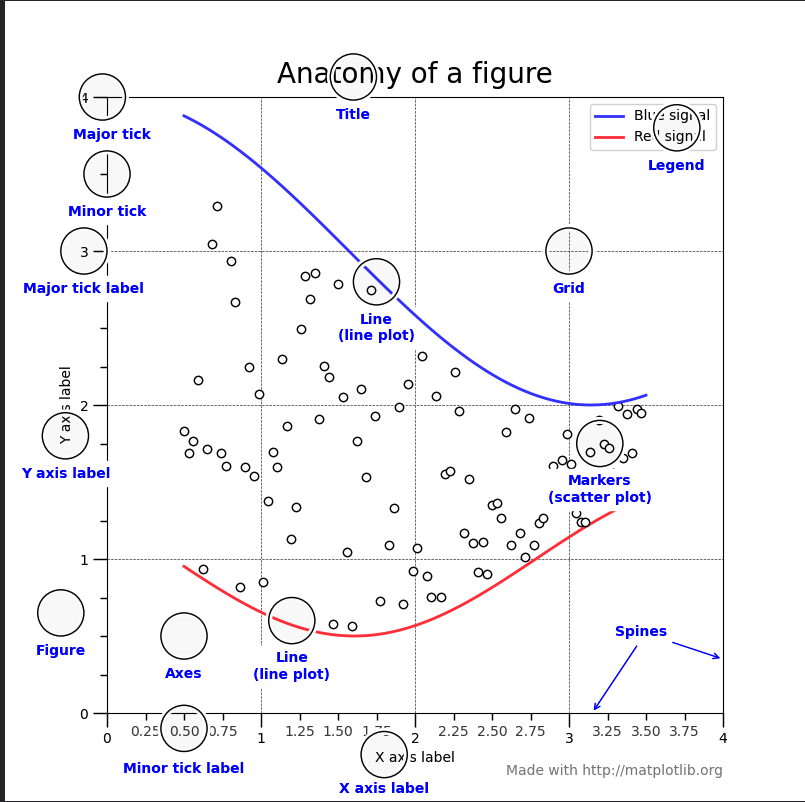

# Table of contents: 
1. [Introduction](#1)
2. [Line plot](#2)
3. [Figures and Axes ](#3)
4. [Default figures and axes](#4)
5. [Anatomy of a figure ](#5)
6. [Lines and markers](#6)
7. [Legends ](#7)
8. [Axis labels and titles](#8)
9. [Axis limits](#9)
10. [Axis ticks](#10)
11. [Axis scales](#11)
12. [Bar charts](#12)
13. [Pie charts](#13)
14. [Scatter plots](#14)
15. [Histograms](#15)
16. [Subplots](#16)
17. [3D plots](#17)
18. [Contour plots](#18)
19. [Plotting with Pandas](#19)

# Introduction 
Install: 

    pip3 install matplotlib.pyplot

To begin include this: 

    # from matplotlib import pyplot as plt # will do the same thing
    import matplotlib.pyplot as plt
    import numpy as np
    import pandas as pd

# Line plot 
- Use `plt.plot([1, 2, 3])` where `[1, 2, 3]` is an example list to be plotted in a line. 
- Use `plt.show()` to display the image
- Use `plt.savefig('my_image')` to save the image

      import matplotlib.pyplot as plt

      # will plot [2, 3, 4] vs [2, 3, 4] by default
      plt.plot([2, 3, 4])
      plt.show()
      plt.savefig('plot.png')

- Specify two parameters to control `x` and `y` values

      import matplotlib.pyplot as plt

      plt.plot([1,2,3,4,5], [5,4,3,2,1])
      plt.savefig('plot.png')

- Plot $x = t\sin t, y = t\cos t$ for $t = 0, 1, ..., 99$

      import matplotlib.pyplot as plt
      import numpy as np

      phi = np.arange(100, dtype=np.float64)
      print(phi)
      plt.plot(phi * np.sin(0.2 * phi), phi * np.cos(0.2 * phi))

      plt.savefig('plot.png')

# Figures and Axes 

- `figure` is whole image
- `axes` are the actual plots. NOT `axis`

      import matplotlib.pyplot as plt
      import numpy as np

      axes = plt.axes()
      print(axes)
      axes.set_title('single axes')

      plt.savefig('plot.png')

# Default figures and axes 

1. When matplotlib is loaded, it automatically creates a `figure`
2. Inside the figure, it contains a default `axes`
3. It is this axes that is drawn on when we use `plt.plot()`.

        import matplotlib.pyplot as plt

        plt.plot([1,2,3,4,5])

        # If `plot` is called again, two lines are drawn on the same plot
        plt.plot([5,4,3,2,1])

        plt.savefig('plot.png')

- `plt.gca()` : get current axes  <-- I haven't used this much
- `plt.gcf()` : get current figure <-- I haven't used this much

**More advanced example: involving styles, legends, titles and tightening layout**
 
- use the `label` parameter in plot so that a name shows up when you use...
- `plt.legend()` plots a legend
- `plt.title('string')` puts a title on figure
- `plt.xlabel('string')` puts an x axis label 
- `plt.ylabel('string')` puts a  y axis label 
- `plt.tight_layout()` puts a tighter layout on figure removing most unecesary whitespace
- `plt.savefig('string')` save the image. 

      import pandas as pd 
      from matplotlib import pyplot as plt

      plt.style.use('seaborn')

      data = pd.read_csv('~/Desktop/python-projects/data/dev_pay.csv')

      # A data frame that looks like this: 
      #    Age  All_Devs  Python  JavaScript
      # 0   18     17784   20046       16446
      # 1   19     16500   17100       16791
      # 2   20     18012   20000       18942
      # 3   21     20628   24744       21780

      ages = data['Age']
      dev_salaries = data['All_Devs']
      py_salaries = data['Python']
      js_salaries = data['JavaScript']

      # python salaries. label is for the legend
      plt.plot(ages, py_salaries, label = 'Python')
      # javascript salaries
      plt.plot(ages, js_salaries, label = 'Javascript')
      # all developer salaries
      plt.plot(ages, dev_salaries, color = '#444444', linestyle = '--', label = 'All Devs')

      # legend
      plt.legend()

      # title
      plt.title('Median salary (AUD) by Age')

      # x and y axis
      plt.xlabel('Ages')
      plt.ylabel('median salary (AUD)')

      # removes some of the whitespace surrounding figure so it's 'nicer'
      plt.tight_layout()

      # shows the plot
      plt.savefig('fig1.png')

**USING THE SUBPLOTS METHOD** 

-  `plt.subplots()` returns a tuple. By defaul it returns `1` axes if no parameters are given. 
- We use the `axes` parameter instead of the `plt` object we had from  before
- All the `plt` becomes `axes` except for things affecting the whole figure. 

  - `.title()` becomes `.set_title()`
  - `.xlabel()` becomes `.set_xlabel()`
  - `.ylabel()` becomes `.set_ylabel()`

        import pandas as pd 
        from matplotlib import pyplot as plt

        plt.style.use('seaborn')

        data = pd.read_csv('~/Desktop/python-projects/data/dev_pay.csv')

        # A data frame that looks like this: 
        #    Age  All_Devs  Python  JavaScript
        # 0   18     17784   20046       16446
        # 1   19     16500   17100       16791
        # 2   20     18012   20000       18942
        # 3   21     20628   24744       21780

        ages = data['Age']
        dev_salaries = data['All_Devs']
        py_salaries = data['Python']
        js_salaries = data['JavaScript']

        # Using the subplots method
        fig, ax = plt.subplots()

        # python salaries. label is for the legend
        ax.plot(ages, py_salaries, label = 'Python')
        # javascript salaries
        ax.plot(ages, js_salaries, label = 'Javascript')
        # all developer salaries
        ax.plot(ages, dev_salaries, color = '#444444', linestyle = '--', label = 'All Devs')

        # legend
        ax.legend()

        # title
        ax.set_title('Median salary (AUD) by Age')
        ax.set_xlabel('Age')
        ax.set_ylabel('Median salary (AUD)')

        # removes some of the whitespace surrounding figure so it's 'nicer'
        plt.tight_layout()

        # shows the plot
        plt.savefig('fig1.png')

**One figure, multiple plots**

To do this we just:

- Input parameters into the `subplots()` function for the `nrows` and `ncols` parameters
- The `subplots()` function will now return a list-- either one dimensional or two dimensional
- To plot, you just decide which one of the `axes` elements to plot into. 
- Everything is still one figure. 

      import pandas as pd 
      from matplotlib import pyplot as plt

      plt.style.use('seaborn')

      data = pd.read_csv('~/Desktop/python-projects/data/dev_pay.csv')

      # A data frame that looks like this: 
      #    Age  All_Devs  Python  JavaScript
      # 0   18     17784   20046       16446
      # 1   19     16500   17100       16791
      # 2   20     18012   20000       18942
      # 3   21     20628   24744       21780

      ages = data['Age']
      dev_salaries = data['All_Devs']
      py_salaries = data['Python']
      js_salaries = data['JavaScript']

      # Using the subplots method. sharex just eliminates all the ticks for 
      # every plot except the lowest one. 
      fig, ax = plt.subplots(nrows = 2, ncols = 1, sharex = True)

      # print(ax) # to see what is printed

      # for the first plot ax[0]
      # python salaries. label is for the legend
      ax[0].plot(ages, py_salaries, label = 'Python')
      # javascript salaries
      ax[0].plot(ages, js_salaries, label = 'Javascript')
      # legend 
      ax[0].legend()
      # title
      ax[0].set_title('Median salary (AUD) by Age')
      #ax[0].set_xlabel('Age')
      ax[0].set_ylabel('Median salary (AUD)')

      # for the second plot ax[1]
      # all developer salaries
      ax[1].plot(ages, dev_salaries, color = '#444444', linestyle = '--', label = 'All Devs')
      ax[1].legend()
      #ax[1].set_title('Median salary (AUD) by Age') 
      ax[1].set_xlabel('Age')
      ax[1].set_ylabel('Median salary (AUD)')

      # removes some of the whitespace surrounding figure so it's 'nicer'
      plt.tight_layout()

      # shows the plot
      plt.savefig('fig1.png')

**Multiple figures**

- With multiple figures, you  just use the `subplots()` function again. 
- Each `figure` owns its own set of axes, so determine which axes to plot on 
- Once you're done with the axes, you deal with the figure with things like:
    - `fig1.tight_layout`
    - `fig1.savefig(...)`

- To show all the figure, you just call `plt.show()`
- The hierachy goes `plt --> figures --> axes` where you can plot multiple plots on axes. 

      import pandas as pd 
      from matplotlib import pyplot as plt

      plt.style.use('seaborn')

      data = pd.read_csv('~/Desktop/python-projects/data/dev_pay.csv')

      # A data frame that looks like this: 
      #    Age  All_Devs  Python  JavaScript
      # 0   18     17784   20046       16446
      # 1   19     16500   17100       16791
      # 2   20     18012   20000       18942
      # 3   21     20628   24744       21780

      ages = data['Age']
      dev_salaries = data['All_Devs']
      py_salaries = data['Python']
      js_salaries = data['JavaScript']

      # Using the subplots method. sharex just eliminates all the ticks for 
      # every plot except the lowest one. 
      fig1, ax1 = plt.subplots()
      fig2, ax2 = plt.subplots()

      # for the first figure
      # python salaries. label is for the legend
      ax1.plot(ages, py_salaries, label = 'Python')
      # javascript salaries
      ax1.plot(ages, js_salaries, label = 'Javascript')

      # additional
      ax1.legend()
      ax1.set_title('Median salary (AUD) by Age')
      ax1.set_xlabel('Age')
      ax1.set_ylabel('Median salary (AUD)')

      # save the first figure
      fig1.tight_layout()
      fig1.savefig('fig1.png')

      # for the second figure
      # all developer salaries
      ax2.plot(ages, dev_salaries, color = '#444444', linestyle = '--', label = 'All Devs')

      # additional
      ax2.legend()
      ax2.set_title('Median salary (AUD) by Age') 
      ax2.set_xlabel('Age')
      ax2.set_ylabel('Median salary (AUD)')

      # save the second figure
      fig2.tight_layout()
      fig2.savefig('fig2.png')

      # plt.show() # uncomment this to show both the figures. 
# Anatomy of a figure 
The anatomy of a figure can be seen in the picture below:

# Lines and markers 
To plot multiple plots on the same axes: 
1. use the `plt.subplots()` function
2. assign the outputs to variables, `fig` and `ax`
3. Use the `ax.plot(x, y)` to plot each plot on the axes
4. Use `fig.savefig('string')` to save the figure. 
5. optionally use `plt.show()` to show the figure. 

        import matplotlib.pyplot as plt
        import numpy as np

        x = np.array([2, 3, 4, 5])
        y = np.array([5, 2, 20, 25])

        fig, ax = plt.subplots()
        ax.plot(x, y)
        ax.plot(x, y*2)
        ax.plot(x, y*3)
        ax.plot(x, y*4)

        fig.savefig('out.png')

        # plt.show()

To give the lines `linestyle` and `color` enter this as an extra parameter for the `.plot()` function

    import matplotlib.pyplot as plt
    import numpy as np

    x = np.array([2, 3, 4, 5])
    y = np.array([5, 2, 20, 25])

    fig, ax = plt.subplots()
    ax.plot(x, y, color='green', linestyle='solid') # solid green line
    ax.plot(x, y*2, color='pink', linestyle='dotted') # dotted pink line
    ax.plot(x, y*3, color='#FF0000', linestyle='-.') # dash-dot red (hex code) line
    ax.plot(x, y*4, color='#000000', linestyle='--') # dashed black (hex code) line

    fig.savefig('out.png')

    # plt.show()

- To specify a `marker` use the `marker` parameter
- If you don't put in a `linestyle` then the plot will only consist of points. 
- So if you want `marker` and `linestyle` for points and lines you need both. 

      import matplotlib.pyplot as plt
      import numpy as np

      x = np.array([2, 3, 4, 5])
      y = np.array([5, 2, 20, 25])

      fig, ax = plt.subplots()
      # circle markers
      ax.plot(x, y, marker = 'o', color='green', linestyle='solid')
      # pink triangle markers, no line
      ax.plot(x, y*2, marker = '^', color='pink')
      # large red diamond markers
      ax.plot(x, y*3, marker =  'd', color='#FF0000', markersize=12, linestyle='solid')
      # grey '+' markers on a dashed black line
      ax.plot(x, y*4, marker = '+', color='#000000', markerfacecolor='gray', linestyle='--')

      fig.savefig('out.png')

      # plt.show()

# Legends 

To add a legend use a `label = 'string'` in the plot function and `.legend()` function. 

    import matplotlib.pyplot as plt
    import numpy as np

    x = np.array([2, 3, 4, 5])
    y = np.array([5, 2, 20, 25])

    fig, ax = plt.subplots()
    # we use the label = 'string' parameter
    ax.plot(x, y, label = 'a')
    ax.plot(x, y*2, label = 'b')
    ax.plot(x, y*3, label = 'c')
    ax.plot(x, y*4, label = 'd')

    # the .legend() parameter
    ax.legend()

    fig.savefig('out.png')

    # plt.show()
# Axis labels and titles 
To set the axis labels and title...
- If you're accessing directly with the `plt` object then use `.xlabel('string')`, `.ylabel('string')` and `.title('string')`
- If you're accessing via an `axes` object then use `.set_xlabel('string')`, `.set_ylabel('string')` and `.set_title('string')`

      import matplotlib.pyplot as plt
      import numpy as np

      x = np.arange(100, dtype=np.float64) 

      fig, ax = plt.subplots()
      # we use the label = 'string' parameter
      ax.plot(x *  np.sin(0.2 * x), x * np.cos(0.2 * x))

      ax.set_title('spiral')
      ax.set_xlabel('the x axis')
      ax.set_ylabel('the y axis')

      fig.savefig('out.png')

      # plt.show()
# Axis limits 

To set axis limits: 
- use the `xlim()` (for `plt` object) or `set_xlim()` (for `ax` object) same for `y`
- input a tuple to set max and min
- if you only want to set one side: `left = a` or `right = b` parameter for `set_xlim()` 
- similarly `bottom = a` or `top = b` for `set_ylim()`

      import matplotlib.pyplot as plt
      import numpy as np

      x = np.arange(100, dtype=np.float64) 

      fig, ax = plt.subplots()
      ax.plot(x *  np.sin(0.2 * x), x * np.cos(0.2 * x))

      ax.set_title('graphs')
      ax.set_xlabel('the x axis')
      ax.set_ylabel('the y axis')

      # set limits via tuple
      ax.set_xlim((-10, 10))
      ax.set_ylim((-10, 10))

      fig.savefig('out.png')

      # plt.show()
# Axis ticks 
- To change the fontsize of the x axis label and y axis label use the `fontsize = a` parameter in the `.set_xlabel(...)` or `.set_ylabel(...)`
- To change the label size of the ticks, use the `labelsize = a` parameter in the `.tick_params(...)` function. 
- To rotate the label use the `rotation = a` parameter in the `.tick_params(...)` function. 

      import matplotlib.pyplot as plt
      from matplotlib import pyplot as plt
      import numpy as np
      import pandas as pd

      ###################################### this code is to just prepare the data frame #################################
      df = pd.read_csv("../data/temp.csv")
      date = df['date'].copy()
      i = 0
      for str_date in date:
          str_array = str_date.split(sep = '/')
          mmddyy = str_array[1] + '/' + str_array[0] + '/' + str_array[2]
          date[i] = mmddyy
          i += 1

      date = pd.to_datetime(date)
      df = pd.concat([df, date], axis = 1)
      df.columns = ['old date', 'temp', 'date']
      del df['old date']
      ###########################################################################################
      print(df.head())

      fig, ax = plt.subplots()

      ax.plot(df['date'], df['temp'])
      ax.set_title('temperatures across days')
      ax.set_xlabel('days', fontsize = 12)
      ax.set_ylabel('temperature', fontsize = 12)

      # sets tick size and tick rotation for x axis. The tick labels get cut off so we use...
      ax.tick_params(axis = 'x', labelsize = 8, rotation = 40)

      # ... the tick_layout() parameter
      fig.tight_layout()
      fig.savefig('out.png')

# Axis scales 
- We can change the scales of the $X$ and $Y$ axes using the `set_xscale('string')` and `set_yscale('string')`
- Matplotlib accepts `linear`, `log`, `symlog` and `logit` scales. 

      import matplotlib.pyplot as plt
      import numpy as np

      x = np.linspace(0, 200, 200)
      fig, ax = plt.subplots()
      ax.plot(x, x, label='$y = x$')
      ax.plot(x, x ** 2, label='$y = x^2$')
      ax.plot(x, np.exp(x), label='$y = e^x$')

      ax.set_yscale('log')

      ax.set_title('Log chart')
      ax.set_xlabel('x')
      ax.set_ylabel('y')
      ax.set_xlim(left=1)
      ax.set_ylim(bottom=1)

      ax.legend()
      fig.savefig('out.png')

# Bar charts 

**NORMAL BAR CHARTS**

To create a bar chart use the `plt.bar(x, y)` function
- `x` is a list of names
- `height` is a numerical list indicating the frequencies of the categories of `x`

      import matplotlib.pyplot as plt

      data = {
          'China': 1402625480,
          'India': 1362187627,
          'US': 329680233,
          'Indonesia': 268074600,
          'Pakistan': 220312891,
      }
      # data.items() : returns a list of tuples [(key1, val1), (key2, val2), ...]
      # *data.items(): returns a vararg structure: (k1, v1), (k2, v2), ...
      # zip(*data.items()): returns (k1, k2, k3, ...), (v1, v2, v3,...)
      labels, values = zip(*data.items())
      fig, ax = plt.subplots()
      ax.bar(labels, values)
      fig.savefig('out.png')

**HORIZONTAL BAR CHARTS**

To create a horizontal bar char use the `plt.barh(x, y)` function

    import matplotlib.pyplot as plt

    fig, ax = plt.subplots()
    ax.barh(['China', 'India', 'US'], [140262, 136218, 32968])
    fig.savefig('out.png')

**CLUSTERED BAR CHARTS**

For clustered bar charts we:

1. Basically plot two bar charts together
2. we set the width to be (for e.g `0.3`). This'll be the width of each bar chart
3. So that we manually specify the `x_pos` of the first and `x_pos + width` for the second
4. we manually specify the ticks `x_pos + width/2` and put the `country labels on`

        import matplotlib.pyplot as plt
        import pandas as pd

        countries = ['China', 'India', 'US', 'Indonesia', 'Pakistan']
        population = [1402625480, 1362187627, 329680233, 268074600, 220312891]
        population_prev = [1338000000, 1234000000, 309000000, 241000000, 179000000]

        # calculate positions of the bars
        width = 0.3
        x_pos = list(range(len(countries)))
        x_pos_prev = [i + width for i in x_pos]

        # figure and axes
        fig, ax = plt.subplots()

        # plot both bars in respective positions
        ax.bar(x_pos_prev, population_prev, width, label='Some years ago')
        ax.bar(x_pos, population, width, label='Current')

        # calculate positions of the ticks, set ticks to country names
        ticks_pos = [i + width / 2 for i in x_pos]
        ax.set_xticks(ticks_pos, countries)

        # show legend
        ax.legend()

        fig.savefig('out.png')

**STACKED BAR CHARTS**

To do a stacked bar chart: 

1. `fig, ax = plt.subplots()`
2. let `width = 0.3` and calculate the `x_pos` of the bar charts
3. plot at the `x_pos` your categories. For subsequent plotting...
4. ... You need to use the `bottom = [numerical list or array]` parameter
5. This parameter is "where the bottom of the current bar chart is". So it's the overall running height.
6. Calculate the position of ticks and set them with `ax.set_xticks(position of ticks, categorical array)`
7. show legend with `ax.legend()`

        import matplotlib.pyplot as plt
        import pandas as pd
        import numpy as np

        hair = ['Brown hair', 'Black hair', 'Blond hair']
        men = np.array([5,3,1])
        women = np.array([2,4,3])
        children = np.array([4, 5, 2])

        # figure and axis
        fig, ax = plt.subplots()

        # calculate the positions of the bars
        width = 0.3
        x_pos = list(range(len(hair)))

        # plot both bars in their respective positions
        ax.bar(x_pos, men, label = 'men')
        ax.bar(x_pos, women, label = 'women', bottom = men)

        # calculate third group: children
        bottom_of_3 = men + women
        ax.bar(x_pos, children, label = 'children', bottom = bottom_of_3)

        # calulates the positions of the ticks and set the 
        ax.set_xticks(x_pos, hair)

        # show legend
        ax.legend()

        fig.savefig('out.png')
# Pie charts 
Use  `.pie(numerical array, categorical array)` to create a bar chart

    import matplotlib.pyplot as plt

    labels = ['Part A', 'Part B', 'Part C']
    sizes = [50, 30, 10]

    fig, ax = plt.subplots()

    ax.pie(sizes, labels=labels)
    fig.savefig('out.png')

To customise it you can use various parameters: 

    import matplotlib.pyplot as plt

    labels = ['Part A', 'Part B', 'Part C']
    sizes = [50, 30, 10]
    explode = (0, 0, 0.2)
    colors = ['lightblue', 'grey', 'pink']

    fig, ax = plt.subplots()

    ax.pie(sizes, colors=colors, explode=explode, shadow=True, autopct='%1.2f%%', labels=labels)
    fig.savefig('out.png')
# Scatter plots 
Use the `ax.scatter(x, y)` to plot a scatter plot:

    import matplotlib.pyplot as plt

    fig, ax = plt.subplots()
    ax.scatter([1,2,3,4,5], [5,4,3,2,1])
    fig.savefig('out.png')

Change colour of the scatter plot: 

    import matplotlib.pyplot as plt

    fig, ax = plt.subplots()
    # single color
    ax.scatter([1, 2, 3, 4, 5], [5, 4, 3, 2, 1], c = 'red')
    # single hex string
    ax.scatter([0, 0, 0, 0, 0], [5, 4, 3, 2, 1], c = '#0000ff')
    # list of colors
    ax.scatter([5, 5, 5, 5, 5], [5, 4, 3, 2, 1], c = ['red', 'green', 'blue', 'yellow', 'orange'])
    fig.savefig('out.png')

Color based on scale:

    import matplotlib.pyplot as plt
    import numpy as np

    rng = np.random.RandomState(12345)
    # 50 random numbers between 0 and 1 
    x = rng.randn(50)
    # 50 random numbers between 0 and 1 
    y = rng.randn(50)
    # 50 random numbers between 0 and 1 
    colour = rng.rand(50)
    # 50 random numbers between 0 and 1000 
    size = 1000 * rng.rand(50)

    fig, ax = plt.subplots()

    # for the scatter plot
    ax.scatter(x, y, c=colour, s=size)

    fig.savefig('out.png')
# Histograms 
To make a historgram use the `ax.hist(data, bins = 50)` where `data` is the numerical data you have the `bins = 50` provides 50 bins.

    import numpy as np
    import matplotlib.pyplot as plt

    # Returns samples from the standard normal distribution.
    data = np.random.randn(500) 

    fig, ax = plt.subplots()

    ax.hist(data, bins=50);

    fig.savefig('out.png')

Controlling the opacity and number of bins. To draw from a standard normal distn, use the `np.pandom.norma(a, b, n)` to sample `n` values from normal distn with mean `-2` and `1` for example. 

    import numpy as np
    import matplotlib.pyplot as plt

    # Returns samples from normal distns with mean 0 and std dev 1 
    # and samples from normal distn with mean -2 and std dev 1
    data1 = np.random.normal(0, 1, 500) 
    data2 = np.random.normal(-2, 1, 500)

    fig, ax = plt.subplots()

    # alpha controls the transparancy 
    ax.hist(data1, bins=50, alpha = 0.4);
    ax.hist(data2, bins=50, alpha = 0.5);

    fig.savefig('out.png')
# Subplots 
The `plt.subplots()` function allows us to change the number of axes in the default figure.
The main parameters are:

- `nrows`, `ncols`: These two parameters divide our figure up into an nrows x ncols grid of axes.
- `figsize`:  a tuple with two integers describing the width and height of the figure in inches.

Subplots return two objects: 
- the figure
- an `ndarray` (of shape `nrows` $\times$ `ncols`) containing the axes. 

Example 1: 

    import matplotlib.pyplot as plt
    import numpy as np

    fig, axes = plt.subplots(nrows=1, ncols=2, figsize=(12, 6))
    axes[0].set_title('Axes 1')
    axes[1].set_title('Axes 2')
    fig.savefig('out.png')

Example 2: example showing how to make lots of names for the plots with for loops

    import matplotlib.pyplot as plt
    import numpy as np

    fig, axes = plt.subplots(nrows=2, ncols=3, figsize=(9, 6))
    for i, row in enumerate(axes):
        for j, a in enumerate(row):
            a.set_title(f'Row {i}, Column {j}')
    fig.savefig('out.png')
# 3D plots 
# Contour plots 
# Plotting with Pandas 
