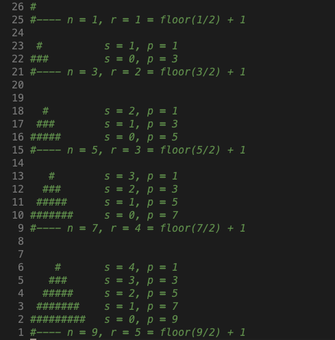

# Table of contents
1. [print, type and variables](#1)
2. [multiple assignment](#2)
3. [useful string methods](#3)
4. [typecasting](#4)
5. [the f-string](#5)
6. [user input](#6)
7. [string slicing](#7)
8. [if-elif-else](#8)
9. [while loop,  None and break](#9)
10. [for loop, ranges and continue](#10)
11. [Nested loops and for-else](#11)
12. [lists](#12)
13. ['=' vs .copy()](#13)
14. [str.split() and str.join()](#14)
15. [enumerate()](#15)
16. [2D lists](#16)
17. [tuples](#17)
18. [sets](#18)
19. [dictionaries](#19)
20. [functions, default values and first class functions](#20)

# print, type and variables 
To print something use the `print()` function. 

The different data types we've encountered are
  
- `str` for the string class
- `int` for the int class
- `float` for the float class
- `bool` for the boolean class

To print out the type of a variable use the `type()` function. To print something out as a string, try and cast it to a string with `str(...)`

Finally to concatenate strings use the `+` operator. 

    height = 165.5
    print("type of height is " + str(type(height)))
    print("You height is " + str(height))

For `int` to increment a variable use the `+=` operator

Floats are imprecise: 
    
    print(0.1 + 0.2) # prints 0.300000000004
    print((0.1 + 0.2) == 0.3) # prints false

So to compare floats, make sure to compare `ranges` instead: 

    result = 0.1 + 0.2 
    target = 0.3 
    epsilon = 0.001
    print(abs(result - target) < epsilon)
   

# multiple assignment 
To assign multiple values in one line of code, use commas

    name, age, truth = "Mason", 21, True

To assign multiple values to the same value, use lots of equals

    mason1 = mason2 = mason3 = 21

# useful string methods 
To find the length of a string use the `len()` method. 

    name = "mason"
    print(len(name))
To return the index of a character in a string, use the method `.find()`

    name = "mason"
    print(name.find("p")) # prints -1
    print(name.find("m")) # prints 0

To capitalise the first letter of a string use `.capitalize()`

    name = "mason"
    print(name.capitalize()) # prints "Mason"

To convert everything to either upper case or lower case use either `.upper()` or `.lower()`

    name = "Mason"
    name1 = name.upper() # "MASON"
    name2 = name.lower() # "mason"

To check if a string contains **only digits** use the `.isdigit()` method. 

    age = "123"
    print(age.isdigit()) # prints true

    age = "123 "
    print(age.isdigit())# prints false. 

To check if a string contains **only letter** use the `.isalpha()` method. 

    name = "masonWong"
    print(name.isalpha()) # prints true

    name = "mason wong"
    print(name.isalpha()) # prints false. 

To replace all chars "i" with "o" use the `.replace()` method. 

    name = "tim tim"
    name1 = name.replace("i", "o")
    print(name1)

To concatenate strings use the `+` operator. To repeat strings use the `*` operator

    greeting = "hello"
    greeting = greeting + " world"
    greeting = greeting + " "
    greeting = greeting * 3
    print(greeting)

# typecasting 
To typecast a variable just surround the variable by the class. For example `str(var)` or `int(var)` or `float(var)` or `bool(var)`. Note that typecasting anything to a `boolean` will become true **so long as** it is not **zero** or an **empty string**. 

    z = "3"
    print(z * 3) # prints 333
    print(int(z) * 3) # prints 9
    print(float(z) * 3) # prints 9.0
    print(bool(z)) # prints true

# the f-string 
Allows us to easily print stirngs interspersed with other types of variables

    age = 18
    print(f'I am {age} years old')

Can do calculations like `+`

    age = 18
    print(f'I am {age + 2} years old')

Can specify the number of decimal places: 

    fraction_of_cake = 2/7
    print(f'I am having {fraction_of_cake:.3f} of the cake')

Can print `{` and `}` by specifying two of them 

    score = 5
    print(f'Your score is: {{score}}')

# user input 
To accept user input we use the `input()` function. It returns a `str` and if we also wanted a prompt we would put an optional string inside the input function `input("prompt")`

Example: 
    
      
    name = input("what is your name: ")
    age = int(input("What is your age: "))
    height = float(input("What is your height: "))
    print("Your name is " + name + " you are " + str(age) + " years old and you are " + str(height) + "cm tall.")

# String slicing 
To split a string we can use: 
- The `[a:b]` indexing operator to obtain indices from $a \le x < b$. **note how the firs index is inclusive whereas the second index is exclusive**.  
- `slice()` function. 

An example of indexing is given below. In python, if you leave out the first index in an index (e.g `name[:6]`) python assumes you mean the `0` index. If you leave out the second index (e.g `name[6:]`) pythong assumes you mean the `last index + 1` (so the end of the string.)

    name = "mason wong"
    first_name = name[0:6] # we want indices 0 to 5. 
    first_name = name[:6] # equivalent to above
    last_name = name[6:10] #  we want indices 6 to 9
    last_name = name[6:] # equivalent to above

An example of an optional paramter in indexing is the `step`. So we can index like `[a:b:c]` where `c` is a step. 

  
    name = "mason wong"
    funky_name = name[::3] # predict: mowg <= [0, 3, 6, 9] are indices
    print(funky_name)

For the string "mason wong", negative indices are defined like so: [-10, -9, -8, -7, -6, -5, -4, -3, -2, -1] $\iff$ [m, a, s, o, n, , w, o, n, g]

To reverse a string until the 7th index

    name = "mason wong"
    reversed_name = name[-1:(-7 - 1): -1] # start from -1, go to -7 - 1 in steps of -1

To reverse a whole string

    name = "mason wong"
    name_length = len(name)
    reversed_name = name[-1: (-1 * name_length - 1): -1]
    print(reversed_name)

Or more shorthand: 

    name = "mason wong"
    reversed_name = name[::-1]
    print(reversed_name)

The thing `a:b:c` is called a slice. In fact we can manually make a slice object

    name = "mason wong"
    print(name[2:(2+3)]) # gets "son"
    my_slice = slice(2, 2+3)
    print(name[my_slice]) # also gets "son"

Another application:

    website1 = "http://google.com"
    website2 = "http://wikipedia.com"
    my_slice = slice(7, -4)
    name1 = website1[my_slice] # gets "google"
    name2 = website2[my_slice] # gets "wikipedia"

# if-elif-else 
The `if`, `elif` and `else` looks like:

    mark = int(input("Enter your mark: "))

    if mark >= 85:
      print("HD")
    elif mark >= 75:
      print("D")
    elif mark >= 65:
      print("CR")
    elif mark >= 50:
      print("P")
    else:
      print("F")

The comparison operators are:

- `>` : greater than
- `<` : less than 
- `>=` : greater than or equal to 
- `<=` : less than or equal to
- `==` : equal to 
- `!=` : not equal to 

The logical operators are: `and`, `or` and `not`

    m = "Magnesium"
    b = "Boronium"
    a = "Aluminium"
    c = "Copper"

    if m >= a and m <= c:
      print("alphabetically " + m + " is between") # doesn't print

    if b >= a and b <= c:
      print("alphabetically " + b + " is between") # does print

# while loop,  None and break 
The `none` keyword is pythons version of **nothing**. 

    name = None 
    user_name = "mason"
    name = input("enter the correct name: ")
    while (name != user_name): 
      name = input("wrong name! Please enter again: ")
    print("You're right! the name was " + name)
    
We can emulate the `do-while` loop with a `True` conditional alongside a conditional `break` statement. 

    magic_number = 7
    user_number = None
    while True: 
      user_number = int(input("Enter a number: "))

      if (user_number == magic_number): 
        break;
    print("You got it! The magic number was " + str(user_number))

# for loop, ranges and continue
`for` loops are used to iterate over things like: `list`, `tuple`, `dictionary`, `set`, `string`, `range()`

- `range(a)` : represents the numbers  `0, 1, 2, ..., a-1`. Equivalent to `range(0, a)`
- `range(a, b)` : represents the numbers `a, a+1, ..., b-1`
- `range(a, b, c)` : represents the numbers from `a, a+1, ..., b-1` but starting at `a` then only taking the numbers that incremently add `c` to them. 

For example: 

    # a list 
    fruits = ["apple", "banana", "orange"]
    for x in fruits: 
      print(x)

    # a string 
    name = "mason wong"
    for c in name: 
      print(c)

    # a range of numbers 
    my_nums = range(0, 10)
    for i in my_nums: 
      print(i)

# Nested loops and for-else 
An example of nested for loops can be seen here when we try to print out triangles with the following code. It can be extended to even numbers, but I'm too lazy. 

A `for-else` is of the form

    for x in (something): 
      # statments
    else: 
      # statement which always executes if for loop finishes
The `else` portion executes when the `for` loop finishes naturally. An example of it not finishing naturally is when we have a `break` statement 

    for x in range(10): 
      if (x == 9): 
        break;
      print(x)
    else: 
      print("the for loop finished naturally") # wont print # wont print
    print("the for loop finished")

Example: 

    import math # import the math module
    num = 9  # the number of hashes at the bottom row
    spaces = range(math.floor(num/2), -1, -1) # a range of the spaces
    counter = 1 # a counter to keep track of the hashes to put
    for i in spaces: # only need to index by the spaces
        # print out spaces
        for s in range(i): 
            print(" ", end = "")
        # print out hashes: we have a for loop to print hashes first
        for h in range(counter): 
            print("#", end = "")
        # always afterwards, we want to increment the counter and have a newline
        else: 
            counter += 2
            print("") # print out the newline

# lists 
Python's version of an array, but you can have more than one variable type. To `print()` the list or elements of the list, we can use the normal `print()` function

    my_list = ["pizza", "hamburger", "hotdog", "spaghetti", "pudding", 12, 3.14]
    print(my_list)
    print(my_list[0])
    print(my_list[1])
    print(my_list[2])
    print(my_list[3])
    print(my_list[4])
    print(my_list[5])
    print(my_list[6])

To change a variable in a list, just use the `[]` operator again. 

    my_list = ["one", "two", 3]
    my_list[2] = "three"
    print(my_list)

To append use the `.append(<val>)` method. 

To remove use the `.remove(<val>)` method.

To remove the last element use the `.pop()` method. 

To insert at an index use the `.insert(index_num, <val>)` method. 

To sort a list use the `.sort()` method. 

To clear a list use the `.clear()` method. 

  
    my_list = [4, 2, 3, 1, "d", "b", "c", "a"]
    my_list.append(5) # adds 5 to the end
    my_list.append("e") # add "e" to the end
    my_list.insert(-1, "to_be_removed") # inserts "to_be_removed" so it's now at the second last pos.
    my_list.remove("to_be_removed") # removes "to_be_removed"
    my_list.pop() # removes "e"
    my_list.clear() # empty list now. Equiv to []

To use the `.sort()` method, all the types in your list have to be the same: 

    my_ints = [8, 2, 5, 3, 1, 4, 6, 7, 10,  9]
    my_ints.sort() # sorted ascended

    my_list = ["bbb", "dd", "a", "c", "e"]
    my_list.sort() # sorted aplhanumerically

Lists support conditionals with the `in` keyword:
    
    letters = ["a", "b", "c"]
    if "a" in letters: 
      print("first letter is in the list")

Recall that if you have a set $A = \{1,2,3,4\}$ and you also hava a set $B = \{x^2 \mid x \in A\}$ we can also write this inpyton like so: 

    A = [1, 2, 3, 4]
    B = [x**2 for x in A] # [1, 4, 9, 16]

# '=' vs .copy() for lists 
when we use the `=` operator, we are passing a `memory address` around. So when when change one of the elements at this memeory address it changes all other things referencing it. 

    a = [7, 8, 9]
    b = a # b has the memory address of a
    b[0] = 5 # this changes 'a' aswell
    print("a: ", a) # prints [5, 8, 9]
    print("b: ", b) # prints [5, 8, 9]

The `.copy()` function makes a new list (so new reference). We can also make a new list with the `list()` function. It creates a list from any enumerable sequence. 

    my_list = [1, 2, 3, 4]
    new_list = my_list.copy() # makes a new list

    my_list = ['dog', 'cat', 'rabbit']
    new_list_one = list(my_list) # makes a new list
    
    my_list = [1, 2, 3, 4, 5]
    new_list_two = list(my_list) # makes a new list

Like strings, lists have the `*`, `+`, `+=`, etc operators. 

    x = [0] * 10 # a list of the element zero. Then put 10 zeroes in the list. 

    y = [[]] * 10 # a list of an empty list. Then replicate the list 10 times
                  # however we replicate the MEMORY ADDRESS

    y[0].append(1) # changes all values in each list element to 1

Concatenate two lists together with `+`

    a = [1, 2, 3]
    b = [4, 5, 6]
    print(a + b)

# str.split() and str.join()
The  `string.split("delimiter")` takes in a string and returns a `list` where the lists elements are obtained by getting the tokens between the delimters

    numbers = input("Enter some numbers: ") # e.g enter 5, 6, 7, 8: numbers <- "5, 6, 7, 8"
    numbers = numbers.split(", ") # numbers <- ['5', '6', '7', '8']

The `"delimiter".join(list)` takes a list and joins the elements together via a delimiter

    words = ["The", "quick", "brown", "fox", "jumped", "over", "the", "lazy", "dog"]
    sentence_separated_by_X = "X".join(words)
    normal_sentence = " ".join(words)
# enumerate 
The `enumerate()` function takes in a `list`, `str` or `tuple` and adds an index alongside the value. Hence we can do something like: 

  names = ['Alice', 'Bob', 'Eve', 'Mallory']

    # Print each name with the index:
    for i, name in enumerate(names):
        print(i, name)
Or 

    s = "abcdefg"
    # Print each char with the index:
    for i, x in enumerate(s):
      print(i, x)
# 2D lists 
Basically, you can have lists as elements of lists and to access them, you need `my_list[a][b]` syntax. For example: 

    
    drinks = ["coffee", "soda", "tea"]
    dinner = ["pizza", "hamburger", "hotdog"]
    dessert = ["cake", "ice cream"]

    food = [drinks, dinner, dessert]

    print(food) # prints [['coffee', 'soda', 'tea'], ['pizza',...],...]
    print(food[2]) # prints ['cake','ice cream']
    print(food[1][0]) # prints 'pizza'
# tuples 
tuples are ordered and **cannot change**. We can still access them with the `[]` operator. 

    student = ("mason", 21, "male")
    print(student) # ('mason', 21, 'male')
    print(student[0]) # 'mason'

tuples also support conditionals in the sense of containing a value:

    student = ("mason", 21, "male")
    if "mason" in student: 
      print("mason is present")

To count the amount of times a value appears, use the `.count(val)` method. To find the index of the first instance of a value use the `.index(val)` method
    
    my_tuple = ["a", "a", "a", "b", "b"]
    count_a = my_tuple.count("a") # returns 3
    count_b = my_tuple.count("b") # returns 2. 
    index_a = my_tuple.index("a") # returns 0 <- index of first
    index_b = my_tuple.index("b") # returns 3 <- index of first

We can create a tuple of a single element with the following syntax:

    names = ('Mason',) # Notice the awkward comma position
    print(names)
    print(len(names))

- We can convert from `tuple` $\implies$ `list` via the `list()` function. 
- We can convert from `list` $\implies$ `tuple` via the `tuple()` function. 

We can also do multiple assignments with tuples and lists: 

    student_one = ("Mason", 21)
    name, age = student_one
    print(name, age)

    student_two = ["Bob", 20]
    name, age = student_two
    print(name, age)
# sets 
To make a set use `{}` curly brackets. They are **unordered** and **unindexed**. To show unordered-ness:
    
    # run this 10 times. The order of the access will be different. 
    set = {"abcd", "cdef", "efgh", "ijkl"}
    for x in set:
        print(x)

Accessing elements in a set is much faster than a list:

    # this will print 'hello world'
    set = {"abcd", "cdef", "efgh", "ijkl"}
    if "abcd" in set: 
      print("hello world")

The methods which update the current set always return `None`. They update and that's it.

    even = {2, 4, 6, 8}
    odd = {1, 3, 5, 7}
    print(even.add(10)) # even = {2,4,6,8,10}
    print(even.remove(10)) # even = {2,4,6,8}
    print(even.clear()) # even = {}
    print(even.update(odd)) # even = {1,3,5,7}

The methds like `.union`, `.intersection`, `.difference` don't update our sets and return the sets from the math operations of $\bigcup$, $\bigcap$ and $\setminus$

    primes = {2, 3, 5, 7}
    dice = {1, 2, 3, 4, 5, 6}
    print(dice.union(primes)) # {1,2,3,4,5,6,7}
    print(dice.insersection(primes)) # {2,3,5}
    print(dice.difference(primes)) # {1,4,6}
# dictionaries 
A dictionary is a collection of {key:value} pairs. It is similar to a set in the sense that the `keys` cannot be repeated. Note that with `lists` and `tuples` are **ordered** whereas `dictionaries` and `sets` are **unordered**

To make a dictionary: 

    # a list of a students marks
    marks = [85, 90, 72, 50]

    # dictionaries make things easier
    marks = {
    'Quiz 1': 85,
    'Quiz 2': 90,
    'Assignment 1': 72,
    'Assignment 2': 50,
    }

To access a value, just use the `key`

    marks = {
        'Quiz 1': 85,
        'Quiz 2': 90,
        'Assignment 1': 72,
        'Assignment 2': 50,
    }

    print(marks['Assignment 1'])
    
To add a value or change a value from an existing key, just assign the value: 

    marks = {
        'Quiz 1': 85,
        'Quiz 2': 90,
        'Assignment 1': 72,
        'Assignment 2': 50
    }
    marks['Final Exam'] = 70 # add a (key, value)
    marks['Quiz 1'] = 90 # change a value from existing key
    print(marks['Final Exam'])
    print(marks['Quiz 1'])

The `=` operator is used for assigning a reference to the memory address. If we didn't want to get the same memory address, we would use the `.copy()` method

    mason_marks = {'Quiz 1': 60, 'Quiz 2': 70, 'Quiz 3': 80}

    # a reference to mason_marks
    reference_to_marks = mason_marks 
    reference_to_marks['Quiz 1'] = 90
    print(mason_marks['Quiz 1'])

    # a new object entirely
    copy_of_marks = mason_marks.copy()
    copy_of_marks['Quiz 1'] = 20
    print(mason_marks['Quiz 1'])

To delete a key value pair we use the `del` operator on the key

    mason_marks = {'Quiz 1': 60, 'Quiz 2': 70, 'Quiz 3': 80}

    del mason_marks['Quiz 1']

We can see whether a key exists or not by using the `in` and `not in` operator

    marks = {
        'Quiz 1': 85, 
        'Quiz 2': 90, 
        'Assignment 1': 72, 
        'Assignment 2': 50,
    }

    if 'Quiz 2' in marks:
        print('The student has taken Quiz 2') # this does print
        
    if 'Quiz 3' not in marks:
        marks['Quiz 3'] = 94 # creates 'Quiz 3' key and assigns the value 94

    print(marks['Quiz 3'])

We can also use the `len()` function to get the length of the dictionary. Not as useful than it is for lists. 

    mason_marks = {'Quiz 1': 60, 'Quiz 2': 70, 'Quiz 3': 80}
    print(len(mason_marks)) # prints 3 

The `dict()` function like the `list()` function creates a new dictionary if not arguments are passed in: 

    x = {}
    x = dict() # equivalent to above

If passed in an existing dictionary, it creates a new dictionary. Not a reference

    x = { 'Alice': 0, 'Bob': 1 }
    y = dict(x)
    y['Eve'] = 99

    print('x', x)
    print('y', y)

As we said before, we can do the same thing with the `.copy()` method. 

    x = { 'Alice': 0, 'Bob': 1 }
    y = x.copy()
    y['Eve'] = 99

    print('x', x)
    print('y', y)

If we try and just access (**_not assign_**) then we run into an error if the key doesnt exist 

    inventory = {'wood': 10, 'water': 12, 'gold': 2} 
    print(inventory['wood']) # prints 10
    print(inventory['silver']) # throws an error

So because of that, we should check whether we have the key before continuing

    inventory = {'wood': 10, 'water': 12, 'gold': 2} 
    item = 'copper'
    if item in inventory: 
        print(inventory[item])
    else: 
        print('You don\'t have any copper')

We can iterate over dictionaries using the same syntax we use for lists and list-like objects.

    prices = {
        'bread': 2.00,
        'cheese': 5.50,
        'milk': 2.79,
    }

    # This prints all the keys of the dictionary
    for item in prices:
        print(item)

If we want to loop over the values,  can access them explicitly using the keys, like this:

    prices = {
        'bread': 2.00,
        'cheese': 5.50,
        'milk': 2.79,
    }

    # This prints all the keys with their associated value
    for item in prices:
        print(item, prices[item])

Since this is such a common operation, we can use the `.items()` funciton provided by the dictionary.

    prices = {
        'bread': 2.00,
        'cheese': 5.50,
        'milk': 2.79,
    }

    # This prints all the keys with their associated value
    for k, v in prices.items():
        print(k, v)

list of tuples $\implies$ dictionary (with `dict()` function)

    scores = [('Alice', 1), ('Bob', 2), ('Eve', 4), ('Mallory', 99)]
    scores = dict(scores)

    print(scores)

dictionary $\implies$ list of tuples (with `list()` and `.items()` function)

    scores = {'Alice': 1, 'Bob': 2, 'Eve': 4, 'Mallory': 99}
    scores = list(scores.items())

    print(scores)

This is useful since we may wish to print the contents of a dictionary in a particular order.

    # Suppose we want to order the names based on their scores.
    scores = {'Alice': 1, 'Bob': 2, 'Eve': 4, 'Mallory': 99}
    scores = list(scores.items())

    # We'll explain how this works in a later chapter.
    scores.sort(key=lambda x: x[1], reverse=True)
    print(scores)

We've seen how we can create lists using list comprehensions. There is a similar operation for dictionarys.

The syntax is the almost the same with for loop at its core, the only difference is the use of curly braces and the need to supply a key as well as a value.

    # Create a dictionary where each key is numeric
    # and is paired with their corresponding value as a string
    d = { x: str(x) for x in range(5) }

    print(d)
# functions, default values and first class functions
To make a function it's like this:

    def my_func(): 
      print("hello world")

To use parameters it's like this: 

    def print_num(n): 
      print(n)

To return paramters and use them it's like this: 

    def identity(n): 
      return n 

    x = identity(5)
    print(x)

To use more than one parameter we can just specify it: 

    def add(x, y): 
      return x + y 

    x = add(5, 9)
    print(x)

We also don't have to return anything: 

    def just_print(a, b, c): 
      print(a)
      print(b)
      print(c)
      return None # or can write 'return ' <-- note the blank! 

Moreover, we can have default values. It's like an optional parameter, where if you don't insert anything, it'll literally default to some predefined value!

    def greet(name, greeting='Hello'):
      print(f'{greeting}, {name}!')
        
    greet('Jacob')
    greet('Jacob', 'Ciao')
    greet('Jacob', greeting = "yo")
    greet(greeting = "bon soir", name = "jacob")

Functions can also be stored in variables (like c's equivalent to a function pointer)

    def add(x, y):
        return x + y

    def mul(x, y):
        return x * y

    # Store the value of `add` into a variable named op
    op1 = add
    print(op1(1, 2))

    op2 = mul
    print(op2(1, 2))

    print(type(op1))
    print(type(op2))

We can pass functions as arguments

    def add(x, y):
        return x + y

    def mul(x, y):
        return x * y

    def operate(f, x, y):
        # Call the function `f` with parameters
        return f(x, y)

    # Here, we pass the `add` function as `f` into the operate function
    print(operate(add, 1, 2))
    print(operate(mul, 1, 2))
